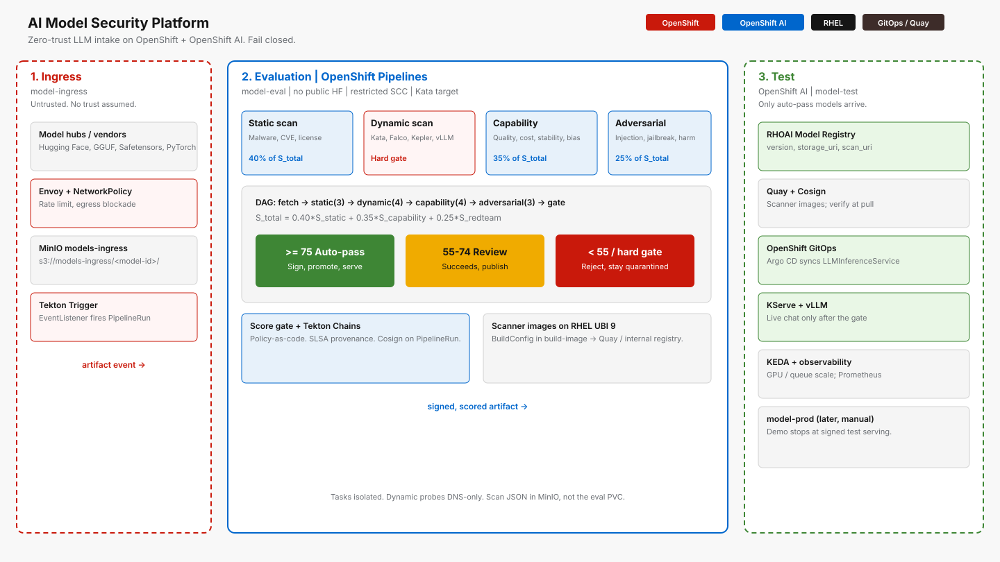

# Architecture

**Status:** design as implemented in this repo (August 2026).  
**Cluster:** one OpenShift cluster, three (plus later four) projects.  
**Serving target:** `model-test` via OpenShift AI. `model-prod` is not written by the pipeline.

*Ingress takes untrusted weights. Evaluation runs OpenShift Pipelines. Test serves auto-pass and review models on OpenShift AI.*

## Purpose

Treat every LLM artifact (Hugging Face Hub, vendor GGUF / Safetensors / PyTorch) as untrusted until it completes evaluation and receives a signed attestation. The platform is a **fail-closed supply-chain gate** in front of OpenShift AI serving.

## Design principles

| Principle | Meaning here |
|-----------|----------------|
| Zero trust | No weight file is served until the pipeline completes and the score gate routes `auto-pass`. |
| Zone isolation | Ingress, eval, and test are separate OpenShift projects with default-deny NetworkPolicies. |
| Fail closed | Dynamic-scan `critical`/`high` rejects. `S_total` below 55 rejects. Publish is gated on routing `auto-pass` or `review`. |
| Supply-chain integrity | Tekton Chains + Cosign for PipelineRun provenance (SLSA 2/3 path). |
| GitOps promotion | OpenShift GitOps syncs `LLMInferenceService` in `model-test`. Production promotion is a human step. |

## Zones

| Zone | Project | Role |
|------|---------|------|
| Ingress | `model-ingress` | HF / vendor intake, Envoy, MinIO `models-ingress`. HTTPS egress allowed (HF Hub). |
| Evaluation | `model-eval` | Tekton Tasks, score gate, scan JSON in MinIO `models-eval`. No general public internet. |
| Test | `model-test` | OpenShift AI serving of verified weights. Hugging Face Hub denied by policy intent. |
| Production | `model-prod` | Later. Not a pipeline output. |

## Red Hat product map

| Layer | Product | Role |
|-------|---------|------|
| Cluster | OpenShift | Projects, SCC, NetworkPolicy, Routes |
| Orchestration | OpenShift Pipelines (Tekton) | `model-security-pipeline` |
| Triggers | Tekton Triggers | EventListener on ingress upload |
| Provenance | Tekton Chains + Cosign | Signed PipelineRun attestations |
| Isolation | Sandboxed Containers (Kata) | Target runtime for dynamic-scan |
| GitOps | OpenShift GitOps (Argo CD) | `model-test` InferenceService |
| Serving | OpenShift AI (KServe, vLLM, Model Registry) | Only after auto-pass |
| Images | RHEL UBI 9 | Scanner/eval/publish images in `build-image` |
| Registry | Quay / internal image registry | Scanner images (weights stay in MinIO) |

## End-to-end flow

1. Operator submits `hf://…` (or equivalent). Fetch Job in `model-ingress` writes `s3://models-ingress/<model-id>/`.
2. Tekton Trigger (or a manual PipelineRun) starts `model-security-pipeline` in `model-eval`.
3. `fetch-artifact` mirrors weights onto PVC `eval-workspace` (`/models` only).
4. Static-scan, then `serve-llm-start` clones git, patches `LLMInferenceService.yaml`, and applies in `model-sandbox` from `s3://models-ingress/<model-id>/`. Isolated-runtime / behavior / resources inspect that serving pod; other subtasks call the URL.
5. Four evaluation stages write findings to `s3://models-eval/<model-id>/<version>/scan-result/`.
6. `score-gate` computes `S_total` and routing. `publish-artifact` runs only when `passed=true`.
7. `finally`: `serve-llm-stop` deletes the sandbox CR (namespace remains); `archive-results` writes `manifest.json`.
8. GitOps updates serving in `model-test`. Chat is possible only for models that passed.

Version key: last five characters of the PipelineRun name (example: `model-security-9x57m` → `9x57m`).

## Current vs target

Pipeline runs call a live eval-zone `LLMInferenceService` for basic-inference, capability, and adversarial subtasks. Unit TaskRuns still use ConfigMap fixtures. Falco, Kepler, full lm-eval, Garak, Promptfoo, and LLM Guard remain follow-ups. Static-scan tools **are** installed. See [README.md](../README.md) §5.

## Related diagrams

- [Pipeline DAG](pipeline.md)
- [Zones and network](zones-and-network.md)
- [Storage](storage-and-registry.md)
- [Score gate](scoring.md)
