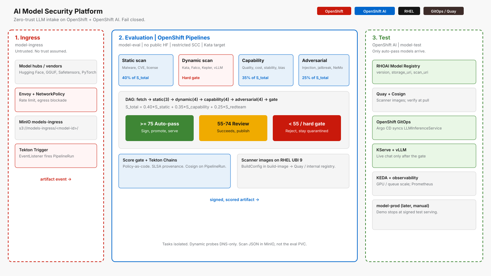

# Architecture

**Status:** design as implemented in this repo (October 2026, branch `multi-model-support`).  
**Platform:** one OpenShift cluster with Red Hat OpenShift AI 3.5, installed by OpenShift GitOps (App-of-Apps).  
**Serving target:** `model-test` on OpenShift AI, behind NeMo Guardrails. `model-prod` is not written by the pipeline.

*Ingress turns a Hugging Face model into an untrusted ModelCar image. Evaluation scans, serves in a sandbox, attacks it (with and without guardrails) and scores it. Test serves models that pass or need review, behind NeMo Guardrails. Every run is logged to MLflow.*

## Purpose

Treat every LLM artifact (Hugging Face Hub, vendor Safetensors) as untrusted until it completes evaluation and receives a signed attestation. The platform is a **fail-closed supply-chain gate** in front of OpenShift AI serving, and a **comparison bench**: the same pipeline evaluates several models so they can be compared on security, capability and guardrail behaviour.

## Design principles

| Principle | Meaning here |
|-----------|--------------|
| Zero trust | Weights are never served until the pipeline completes and the score gate routes `auto-pass` or `review`. |
| Zone isolation | Ingress, evaluation, sandbox and test are separate projects with default-deny NetworkPolicies. The sandbox has no internet egress. |
| Fail closed | Dynamic-scan `critical`/`high` rejects. `S_total` below 55 rejects. Publish only on `auto-pass` or `review`. |
| Immutable artifacts | Weights travel as OCI ModelCar images; the verified copy is a new tag, not a file copy. |
| Defence in depth | The model is attacked twice: directly (its own safety, scored in `S_redteam`) and through NeMo Guardrails (the rails in front of it). |
| Supply-chain integrity | Tekton Chains + Cosign for PipelineRun provenance (SLSA 2/3 path). |
| Everything from Git | Argo CD installs the platform; runtime secrets come from a local `.env` and never enter Git. |
| Traceable results | Raw results in MinIO, serving record in the Model Registry, every run (pass or reject) in MLflow. |

## Zones

| Zone | Project | Role |
|------|---------|------|
| Ingress | `model-ingress` | `model-fetch` Job: Hugging Face → ModelCar image → Quay `<model-id>-unverified`. HTTPS egress allowed (HF Hub, Quay). |
| Evaluation | `model-eval` | Tekton PipelineRuns, scanners, score gate, publish; scan JSON to MinIO `models-eval`; runs to MLflow. No general public internet. |
| Sandbox | `model-sandbox` | Per-run vLLM of the **unverified** model plus a per-run `NemoGuardrails` server. No internet egress, reachable only from `model-eval`. |
| Test | `model-test` | Verified model on KServe/vLLM, behind `NemoGuardrails` with authentication (kube-rbac-proxy). One model at a time (one GPU). |
| Production | `model-prod` | Later. Not a pipeline output. |

Platform namespaces: `minio-system` (scan results, MLflow artifacts), `rhoai-model-registries` (Model Registry), `redhat-ods-applications` (dashboard, MLflow server), `build-image` (scanner image builds), `openshift-gitops`.

## Models

All models share one Quay repository (`MODELCAR_IMAGE`); the tag carries the model: `<model-id>-unverified` → `<model-id>-verified-<score>-<version>`.

| Model | Hugging Face | Notes |
|-------|--------------|-------|
| Qwen3 8B FP8 | `RedHatAI/Qwen3-8B-FP8-dynamic` | Default. Reasoning model (`<think>` output) |
| Granite 4.1 8B FP8 | `RedHatAI/granite-4.1-8b-fp8` | Thinking off (template only reasons on request); `--max-model-len 16384` |
| Llama 3.1 8B Instruct FP8 | `RedHatAI/Meta-Llama-3.1-8B-Instruct-FP8-dynamic` | No reasoning mode; `--max-model-len 16384`; Meta license (HF token) |

`./deploy.sh --compare` runs all three and writes a side-by-side report; MLflow keeps every run for interactive comparison ([Deployment_Steps.md](../Deployment_Steps.md) 5.6, 5.7).

## Red Hat product map

| Layer | Product | Role |
|-------|---------|------|
| Cluster | OpenShift | Projects, SCC, NetworkPolicy, Routes |
| GitOps | OpenShift GitOps (Argo CD) | App-of-Apps installs operators, zones, Tekton, RHOAI, MLflow (`instances/gitops`) |
| Orchestration | OpenShift Pipelines (Tekton) | `model-security-pipeline` |
| Triggers | Tekton Triggers | EventListener (manual PipelineRuns preferred today) |
| Provenance | Tekton Chains + Cosign | Signed PipelineRun attestations |
| Isolation | Sandboxed Containers (Kata) | Target runtime for dynamic-scan |
| Serving | OpenShift AI: KServe `LLMInferenceService`, vLLM | Sandbox (unverified) and test (verified) serving |
| Guardrails | OpenShift AI: TrustyAI `NemoGuardrails` | Input/output rails in front of sandbox and test models |
| Registry | OpenShift AI Model Registry | Verified model versions with `oci://` URI and scan URI |
| Experiment tracking | OpenShift AI MLflow (`mlflowoperator`) | One MLflow run per PipelineRun; compare runs in the dashboard |
| Gateway / auth | Connectivity Link (Kuadrant, Authorino), Gateway API | Inference gateway with TLS and token auth |
| Images | RHEL UBI 9 | Scanner / eval / publish images in `build-image` |
| Weights | Quay | ModelCar images (unverified + verified tags) |

## End-to-end flow

1. **Intake.** The `model-fetch` Job in `model-ingress` downloads the model from Hugging Face and pushes `<repo>:<model-id>-unverified` to Quay.
2. **Start.** A PipelineRun of `model-security-pipeline` starts in `model-eval` (`deploy.sh`, `oc create`, or a Tekton Trigger).
3. **Fetch.** `fetch-artifact` extracts `/models` from the unverified ModelCar onto PVC `eval-workspace`.
4. **Static scan** (malware, CVEs, license) on the files.
5. **Sandbox serving.** `serve-llm-start` applies the model's sandbox `LLMInferenceService` in `model-sandbox` with the unverified image; dynamic scan inspects the serving pod (hard gate).
6. **Guardrails in the sandbox.** `nemo-guardrails-start` deploys a `NemoGuardrails` server in front of the sandbox model.
7. **Capability and adversarial tests.** Capability (quality, cost, stability, bias) and red-team subtasks call the model directly; the `nemo-guardrails` subtask sends the same kinds of attacks through the guardrails. All findings go to `s3://models-eval/<model-id>/<version>/scan-result/`.
8. **Score.** `score-gate` computes `S_total` and routing (`auto-pass` ≥ 75, `review` ≥ 55, otherwise `reject`).
9. **Publish** (auto-pass or review). `publish-artifact` re-tags the ModelCar `<model-id>-verified-<score>-<version>`, registers it in the Model Registry and applies the model's verified `LLMInferenceService` in `model-test`; `nemo-guardrails-test` puts authenticated guardrails in front of it.
10. **Always** (`finally`). The sandbox model and guardrails are deleted; `archive-results` writes `manifest.json` and logs the run to MLflow (parameters, scores, finding counts, attack success rates, guardrail block / false-positive / thinking rates, all result files).

Version key: last five characters of the PipelineRun name (`model-security-9x57m` → `9x57m`).

## Where results live

| What | Where | Used for |
|------|-------|----------|
| Weights | Quay ModelCar tags | Sandbox and test serving |
| Raw results | MinIO `models-eval/<model-id>/<version>/scan-result/` | Score gate, publish, audit (source of truth) |
| Served versions | Model Registry | What runs in `model-test` and where it came from |
| Run history | MLflow experiment `ai-model-security-pipeline`, workspace `model-eval` | Comparing models and reruns over time |
| Comparison snapshot | `model-comparison-<time>.md/.html` (`deploy.sh --compare`) | Sharing results without cluster access |

## Current vs target

Pipeline runs call live sandbox and test models for basic-inference, capability, adversarial and guardrails subtasks; unit TaskRuns use fixtures. Falco, Kepler, full lm-eval, Garak, Promptfoo and LLM Guard remain follow-ups. MLflow runs on SQLite with one replica (lab sizing); PostgreSQL and two replicas are the production path. Runtime observability dashboards for the served models (latency, GPU, guardrail traffic) are a later addition. See [README.md](../README.md) §5.

## Related documents

- [Pipeline DAG](pipeline.md)
- [Zones and network](zones-and-network.md)
- [Storage and registry](storage-and-registry.md)
- [Score gate](scoring.md)
- [NeMo Guardrails](nemo-guardrails.md)
- [Deployment steps](../Deployment_Steps.md)
