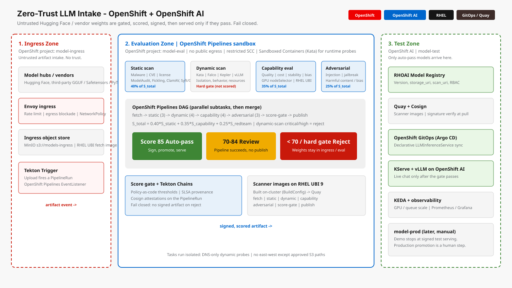

# DemoJam proposal

**Title:** Don't Trust the Weights: Zero-Trust LLM Intake on OpenShift + OpenShift AI  
**Deadline:** 31 August 2026, 12:00 PM UTC  
**Upload:** [diagrams/demojam-architecture.svg](diagrams/demojam-architecture.svg)

## Abstract (form)

Enterprises are pulling LLM weights from Hugging Face and vendors into production with almost no supply-chain control. Pickle malware, denied licenses, CVE-laden dependencies, sandbox breakouts, and jailbreaks all look like “just another model.”

This demo shows a fail-closed, three-zone pipeline on Red Hat OpenShift that treats every artifact as untrusted until it earns a signed attestation — then serves it on Red Hat OpenShift AI.

1. Ingress (`model-ingress`): Hugging Face / vendor weights land behind Envoy, NetworkPolicy, and object storage. A Tekton Trigger fires on upload.
2. Evaluation (`model-eval`): OpenShift Pipelines runs static scan (malware, CVE, license), dynamic scan in Sandboxed Containers (hard gate), GPU capability eval, and adversarial probes (injection, jailbreak, harmful content). A policy score gate routes auto-pass (>=85) / review (70-84) / reject (<70). Tekton Chains + Cosign attach SLSA provenance. Rejected weights never leave the eval zone.
3. Test (`model-test`): Auto-pass models register in the OpenShift AI Model Registry. OpenShift GitOps syncs a KServe/vLLM LLMInferenceService. Live chat is only for models that passed.

The live contrast: a poisoned pickle is blocked on screen; a clean model is signed, promoted, and answered from OpenShift AI. Scanner images are RHEL UBI 9. The stack is kustomize overlays plus a runbook — ready to wrap as an RHDP catalog item.

Platforms: OpenShift (Pipelines, GitOps, Sandboxed Containers, NetworkPolicy) + OpenShift AI (registry, serving) + RHEL (UBI scanners).

## Business value (form)

Customers cannot treat public model hubs as a trusted software supply chain. A single unsafe weight file can ship malware, copyleft or denied licenses, silent CVEs, GPU cost blow-ups, or a model that jailbreaks in production.

This demo is the control plane they are missing:

- Risk reduction: malware, license, CVE, runtime breakout, and adversarial findings are scored before any user talks to the model.
- Fail closed: below threshold or a dynamic hard-gate finding, the pipeline fails and weights stay quarantined. Nothing is signed. Nothing is served.
- Audit and reuse: every run leaves scan JSON, a composite score, and SLSA provenance. Same pattern for banks, telcos, public sector, and ISVs — swap the model, keep the zones.
- Time to safe serving: auto-pass (>=85) promotes through GitOps to OpenShift AI instead of a weeks-long spreadsheet review.
- Platform leverage: OpenShift and OpenShift AI as the AI supply-chain gate, not only the inference runtime.

## Platforms (form)

| Field | Value |
|-------|--------|
| Primary | OpenShift (Pipelines, GitOps, Sandboxed Containers, NetworkPolicy / SCC) |
| Secondary | OpenShift AI / Red Hat AI (Model Registry, KServe + vLLM) |
| Optional third | RHEL (UBI 9 scanner images). Do not list Ansible unless an AAP/RHDP wrapper is in the demo. |

## Guidelines

| Criterion | How this demo hits it |
|-----------|------------------------|
| Cross-platform | OpenShift + OpenShift AI (+ RHEL UBI) |
| Business impact | Any account consuming third-party LLMs; same story in every region |
| Replicability | Overlays `00`–`17` + `script.sh`; maps to an RHDP catalog item |
| Exciting | DAG + red reject vs green auto-pass, then chat on OpenShift AI |

## 8-minute outline

1. **0:00–0:45** — Would you `pip install` a random wheel into prod? Then why `hf download` into vLLM?
2. **0:45–2:00** — Three OpenShift projects, fail closed. Point at the architecture slide.
3. **2:00–4:30** — Path A: malicious / pickle fixture. Static critical → score gate **reject**. No registry entry. No InferenceService.
4. **4:30–7:00** — Path B: clean model. DAG through auto-pass. Chains. GitOps. OpenShift AI chat responds.
5. **7:00–8:00** — Policy thresholds, RHDP repeatability, OpenShift as supply chain / OpenShift AI as the only serving path that survived it.

## Related design docs

[Architecture](architecture.md) · [Pipeline](pipeline.md) · [Scoring](scoring.md) · [Zones](zones-and-network.md) · [Storage](storage-and-registry.md)
