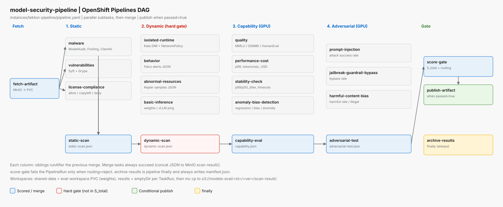

# Pipeline

**Pipeline:** `model-security-pipeline` in `model-eval`  
**Source:** [`instances/tekton-pipeline/pipeline.yaml`](../instances/tekton-pipeline/pipeline.yaml)



*Parallel subtasks merge before the next stage. `publish-artifact` is conditional. `archive-results` is `finally`.*

## Params and workspaces

| Name | Kind | Role |
|------|------|------|
| `model-id` | param | Key under `models-ingress/` (example: `redhatai-qwen3-8b-fp8-dynamic`) |
| `model-path` | param | Default `/workspace/models` |
| `model-registry-namespace` | param | Default `rhoai-model-registries` |
| `git-url` | param | Git repo with serving YAML |
| `model-sandbox-path` | param | Default `instances/model-sandbox` |
| `model-test-path` | param | Default `instances/model-test/llm-models` |
| `shared-data` | workspace | PVC `eval-workspace` — **weights only** |
| `results` | workspace | Pod-local `emptyDir` for JSON before S3 upload; not shared across TaskRuns |

Capability-eval and adversarial-test TaskRuns are CPU HTTP clients. GPU is requested by the **sandbox** `LLMInferenceService` in `model-sandbox`.

## DAG (as coded)

```text
fetch-artifact
  -> malware | vulnerabilities | license-compliance  -> static-scan (merge)
  -> serve-llm-start
  -> isolated-runtime | behavior | abnormal-resources | basic-inference  -> dynamic-scan (merge)
  -> quality | performance-cost | stability-check | anomaly-bias-detection  -> capability-eval (merge)
  -> prompt-injection | jailbreak-guardrail-bypass | harmful-content-bias  -> adversarial-test (merge)
  -> score-gate
  -> publish-artifact   when routing is auto-pass or review

finally: serve-llm-stop, archive-results
```

Merge Tasks always succeed. They concat per-subtask JSON into `static-scan.json`, `dynamic-scan.json`, `capability.json`, `adversarial-test.json`.

## Stages

### Fetch

| Pipeline task | Tekton Task | Image | Output |
|---------------|-------------|-------|--------|
| `fetch-artifact` | `fetch-artifact` | `ai-security-model-fetch` | Weights on eval PVC |

### Static security scanning (stage 1)

| Pipeline task | Tekton Task | Tools (installed) | Scan object |
|---------------|-------------|-------------------|-------------|
| `malware` | `static-scan-malware` | Magika, ModelAudit, Fickling, ModelScan, ClamAV | `static-malware.json` |
| `vulnerabilities` | `static-scan-vulnerabilities` | Syft + Grype | `static-vulnerabilities.json` |
| `license-compliance` | `static-scan-license-compliance` | LICENSE / config.json / Syft + `policy.json` | `static-license-compliance.json` |
| `static-scan` | `static-scan-merge` | concat | `static-scan.json` |

Immediate-fail (Task stops the pipeline): ModelAudit critical matching exec/eval/os.system/pickle needles; ClamAV FOUND; required tool missing / empty SBOM. License deny-list and CVEs continue so the composite can be scored.

### Dynamic scan (stage 2) — hard gate

Not part of `S_total`. Score-gate rejects on `critical` or `high` in `dynamic-scan.json`.

| Pipeline task | Tekton Task | Intent | Today |
|---------------|-------------|--------|-------|
| `isolated-runtime` | `dynamic-scan-isolated-runtime` | Sandbox pod runtimeClass + NetworkPolicy | `oc` inspect + Python |
| `behavior` | `dynamic-scan-behavior` | Falco fixture or sandbox pod events | Fixture JSON / events |
| `abnormal-resources` | `dynamic-scan-abnormal-resources` | Kepler fixture or sandbox pod OOM | Fixture JSON / pod status |
| `basic-inference` | `dynamic-scan-basic-inference` | HTTP ping to sandbox `LLMInferenceService` | Live in pipeline |
| `dynamic-scan` | `dynamic-scan-merge` | concat | `dynamic-scan.json` |

`RUNTIME_CLASS=kata` is unused as proof. Live isolated-runtime inspects the sandbox serving pod.

### Capability evaluation (stage 3) — 35% of `S_total`

HTTP clients against `model-endpoint`. Image is UBI Python (`vllm_client.py`). Full lm-eval / TruLens are not installed. Unit fixtures still work without an endpoint.

| Pipeline task | Output |
|---------------|--------|
| `quality` | `capability-quality.json` (live prompts or fixture thresholds) |
| `performance-cost` | `capability-performance-cost.json` (p99, tokens/sec, cost) |
| `stability-check` | `capability-stability.json` (p99/p50, jitter, timeouts) |
| `anomaly-bias-detection` | `capability-anomaly-bias.json` (regression, bias, anomaly rate) |
| `capability-eval` | `capability.json` |

### Adversarial test (stage 4) — 25% of `S_total`

HTTP clients against `model-endpoint`. Garak / PyRIT / Promptfoo / LLM Guard are **not** installed.

| Pipeline task | Output |
|---------------|--------|
| `prompt-injection` | `adversarial-prompt-injection.json` |
| `jailbreak-guardrail-bypass` | `adversarial-jailbreak-guardrail-bypass.json` |
| `harmful-content-bias` | `adversarial-harmful-content-bias.json` |
| `adversarial-test` | `adversarial-test.json` |

### Gate, publish, archive

| Pipeline task | When | Effect |
|---------------|------|--------|
| `serve-llm-start` | After static-scan; all later tasks wait | Clone git, patch+apply `LLMInferenceService` in `model-sandbox`; result `endpoint-url` |
| `score-gate` | After adversarial merge | Writes `score.json`; Task fails only on `routing=reject` |
| `publish-artifact` | `when: routing in auto-pass, review` | Weights to `models-verified`; register MR; apply patched CR in `model-test` |
| `serve-llm-stop` | `finally` | Deletes the sandbox `LLMInferenceService` (namespace stays) |
| `archive-results` | `finally` (always) | `manifest.json` in the same scan-result prefix |

## Scanner images

Built in namespace `build-image` (no zone NetworkPolicy). Pulled by Tasks from the in-cluster registry.

`image-registry.openshift-image-registry.svc:5000/build-image/ai-security-<name>:latest`

| BuildConfig | Used by |
|-------------|---------|
| `ai-security-model-fetch` | fetch-artifact, ingress HF Job |
| `ai-security-static-scan` | static subtasks |
| `ai-security-dynamic-test` | dynamic subtasks |
| `ai-security-capability-eval` | capability subtasks |
| `ai-security-adversarial-test` | adversarial subtasks |
| `ai-security-score-gate` | score-gate |
| `ai-security-publish` | publish-artifact, archive-results |

See [`builds/README.md`](../builds/README.md).
