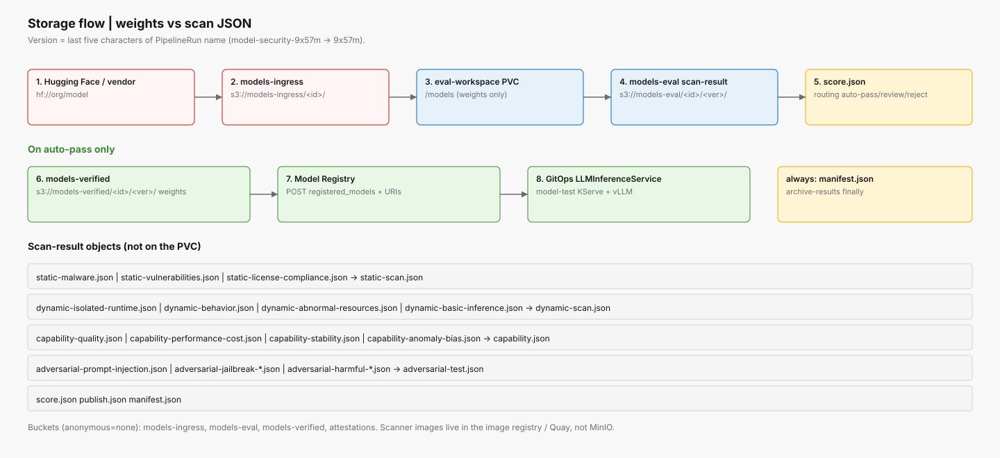

# Storage and registry

**MinIO overlay:** [`overlays/05-storage`](../overlays/05-storage)  
**Buckets:** created by [`instances/minio/bucket-init-job.yaml`](../instances/minio/bucket-init-job.yaml)



*Weights and scan JSON never share a prefix. Version is the last five characters of the PipelineRun name.*

## What lives where

| Asset | Store | Namespace | Notes |
|-------|-------|-----------|-------|
| Scanner images | Internal registry / Quay | `build-image` | Not model weights |
| Untrusted weights | MinIO `models-ingress/<model-id>/` | cluster S3 | HF fetch Job writes here |
| Eval workspace | PVC `eval-workspace` | `model-eval` | `/models` only — no scan JSON |
| Scan JSON | MinIO `models-eval/<model-id>/<version>/scan-result/` | S3 | Per-subtask + merges + `score.json` |
| Verified weights | MinIO `models-verified/<model-id>/<version>/` | S3 | Publish on auto-pass or review |
| Attestations | MinIO `attestations/` | S3 | Tekton Chains target |
| Serving pointer | RHOAI Model Registry | `rhoai-model-registries` | `storage_uri`, `scan_uri`, `version` |

Anonymous access on all four buckets is `none`.

## Version key

PipelineRun `model-security-9x57m` → version `9x57m`.

```text
s3://models-eval/<model-id>/9x57m/scan-result/*.json
s3://models-verified/<model-id>/9x57m/          # weights only, auto-pass
```

## Object names in `scan-result/`

| Writer | Object |
|--------|--------|
| Static subtasks | `static-malware.json`, `static-vulnerabilities.json`, `static-license-compliance.json` |
| Static merge | `static-scan.json` |
| Dynamic subtasks | `dynamic-isolated-runtime.json`, `dynamic-behavior.json`, `dynamic-abnormal-resources.json`, `dynamic-basic-inference.json` |
| Dynamic merge | `dynamic-scan.json` |
| Capability subtasks | `capability-quality.json`, `capability-performance-cost.json`, `capability-stability.json`, `capability-anomaly-bias.json` |
| Capability merge | `capability.json` |
| Adversarial subtasks | `adversarial-prompt-injection.json`, `adversarial-jailbreak-guardrail-bypass.json`, `adversarial-harmful-content-bias.json` |
| Adversarial merge | `adversarial-test.json` |
| Score gate | `score.json` |
| Publish | `publish.json` |
| Archive (`finally`) | `manifest.json` |

## Hugging Face download

```text
hf://RedHatAI/Qwen3-8B-FP8-dynamic
  -> model-fetch Job (model-ingress)
  -> s3://models-ingress/redhatai-qwen3-8b-fp8-dynamic/
  -> Trigger or manual PipelineRun
  -> fetch-artifact: mc mirror onto eval PVC
```

Ingress may use HTTPS to the Hub. Eval must not.

## Model Registry and serving

On auto-pass or review, `publish-artifact`:

1. Refuses unless `score.json` routing is `auto-pass` or `review`.
2. Copies weights to `s3://models-verified/<model-id>/<version>/`.
3. `POST /api/model_registry/v1alpha3/registered_models` with storage URI, scan URI, and routing.

OpenShift GitOps then syncs `LLMInferenceService` in `model-test` (registry annotations + `s3://` URI). See [GitOps promotion](diagrams/gitops-promotion.svg).

Cosign signing of the weight blob itself is documented; the publish Task does not invoke Cosign today (Chains covers PipelineRun provenance).
