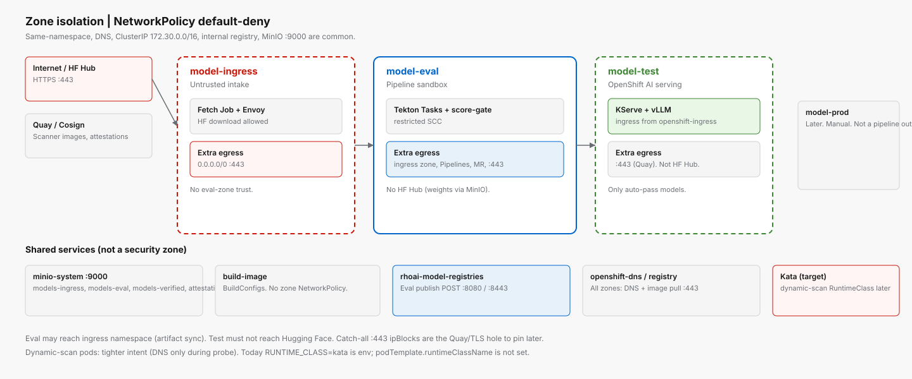

# Zones and network

**Overlay:** [`overlays/04-zones`](../overlays/04-zones/kustomization.yaml)  
**Policies:** `instances/model-ingress/networkpolicy.yaml`, `instances/model-eval/networkpolicy.yaml`, `instances/model-sandbox/networkpolicy.yaml`, `instances/model-test/networkpolicy.yaml`



*Default deny cross-namespace. Each zone allows DNS, in-cluster registry, MinIO, and a narrow extra set.*

## Projects

| Project | Zone label intent | Workloads |
|---------|-------------------|-----------|
| `model-ingress` | Untrusted intake | Fetch Job, Envoy, ingress PVC/S3 client |
| `model-eval` | Pipeline sandbox | PipelineRuns, Tasks, score-gate, publish |
| `model-sandbox` | Untrusted eval vLLM | Persistent NS; CR applied by `serve-llm-start`, deleted by `serve-llm-stop` |
| `model-test` | Verified serving | KServe / vLLM after auto-pass |
| `model-prod` | Later | Manual promotion only |
| `minio-system` | Object store | MinIO API :9000, console Route |
| `build-image` | Image builds | BuildConfigs — **no zone NetworkPolicy** |
| `rhoai-model-registries` | OpenShift AI registry | Model Registry API |

## Egress by zone (as coded)

All three zone policies: default deny Ingress+Egress, then allow same-namespace pods, OpenShift DNS, ClusterIP DNS/443 (`172.30.0.0/16`), internal image registry :443, MinIO :9000.

| Zone | Extra egress | Extra ingress |
|------|----------------|---------------|
| Ingress | `0.0.0.0/0:443` (Hugging Face Hub) | Same-namespace only |
| Eval | Ingress zone (artifact sync), OpenShift Pipelines :443, Model Registry :8080/:8443, `0.0.0.0/0:443` (Quay / Cosign path). `serve-llm-*` Task pods additionally get unrestricted egress so `oc` can reach kube-apiserver on host:6443 (OVN DNAT). Isolated-runtime pods stay on the default policy. | Same-namespace + pods from ingress zone |
| Test | `0.0.0.0/0:443` (Quay); **not** intended for HF Hub | Same-namespace + `openshift-ingress` |

Eval comment in YAML: no general public internet — Quay + cluster services. The catch-all `:443` ipBlock is the practical hole for Quay; tighten if the cluster can pin Quay CIDRs.

## Isolation controls

| Control | Role |
|---------|------|
| NetworkPolicy | East-west deny except listed namespaces/ports |
| Restricted SCC | Pipeline Task pods |
| Sandboxed Containers (Kata) | Target for dynamic-scan; `RUNTIME_CLASS` env today, RuntimeClass on the pod later |
| Tekton Triggers NetworkPolicy | EventListener in eval (see `instances/tekton-triggers/networkpolicy-eventlistener.yaml`) |

## Data paths that must stay open

```text
model-ingress  --s3:9000-->  minio-system  (models-ingress)
model-eval     --s3:9000-->  minio-system  (models-eval, models-verified, attestations)
model-eval     --https---->  rhoai-model-registries  (register on auto-pass)
model-test     --s3:9000-->  minio-system  (read models-verified)
```

No Task in eval should reach Hugging Face Hub; weights arrive via MinIO from ingress.

## Maturity path

Single cluster for the MVP. Physical cluster split per zone is a later HLD step. Kata GPU passthrough is not wired; capability and adversarial TaskRuns use restricted SCC + GPU `nodeSelector` instead of `runtimeClassName: kata`.
