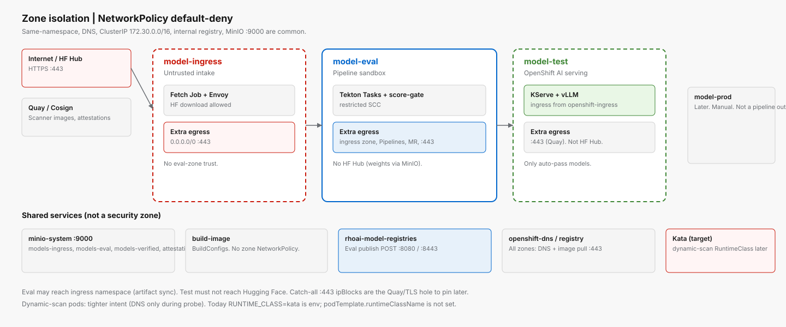

# Zones and network

**Overlay:** [`overlays/04-zones`](../overlays/04-zones/kustomization.yaml)  
**Policies:** `instances/model-ingress/networkpolicy.yaml`, `instances/model-eval/networkpolicy.yaml`, `instances/model-sandbox/networkpolicy.yaml`, `instances/model-test/networkpolicy.yaml`



*Default deny cross-namespace. Each zone allows DNS, in-cluster registry, MinIO, and a narrow extra set.*

## Projects

| Project | Zone label intent | Workloads |
|---------|-------------------|-----------|
| `model-ingress` | Untrusted intake | Fetch Job, Envoy, ingress PVC/S3 client |
| `model-eval` | Pipeline sandbox | PipelineRuns, Tasks, score-gate, publish |
| `model-sandbox` | Untrusted eval vLLM | Persistent NS; CR applied by `serve-llm-start`, deleted by `serve-llm-stop`. Per-run `NemoGuardrails` CR (`nemo-guardrails-start` / `-stop`) |
| `model-test` | Verified serving | KServe / vLLM after auto-pass, behind `NemoGuardrails` `nemo-guardrails` (auth on) |
| `model-prod` | Later | Manual promotion only |
| `minio-system` | Object store | MinIO API :9000, console Route |
| `build-image` | Image builds | BuildConfigs — **no zone NetworkPolicy** |
| `rhoai-model-registries` | OpenShift AI registry | Model Registry API |
| `redhat-ods-applications` | OpenShift AI | Dashboard, MLflow tracking server (operator-managed NetworkPolicy; egress to MinIO added in `instances/mlflow/mlflow.yaml`) |

## Egress by zone (as coded)

All three zone policies: default deny Ingress+Egress, then allow same-namespace pods, OpenShift DNS, ClusterIP DNS/443 (`172.30.0.0/16`), internal image registry :443, MinIO :9000.

| Zone | Extra egress | Extra ingress |
|------|----------------|---------------|
| Ingress | `0.0.0.0/0:443` (Hugging Face Hub) | Same-namespace only |
| Eval | Ingress zone (artifact sync), OpenShift Pipelines :443, Model Registry :8080/:8443, `0.0.0.0/0:443` (Quay / Cosign path). `serve-llm-*` Task pods additionally get unrestricted egress so `oc` can reach kube-apiserver on host:6443 (OVN DNAT). Isolated-runtime pods stay on the default policy. | Same-namespace + pods from ingress zone |
| Test | `0.0.0.0/0:443` (Quay); **not** intended for HF Hub | Same-namespace + `openshift-ingress` |

Eval comment in YAML: no general public internet — Quay + cluster services. The catch-all `:443` ipBlock is the practical hole for Quay; tighten if the cluster can pin Quay CIDRs.

### NeMo Guardrails traffic

One extra rule is needed, in `model-test` only:

- `instances/model-test-ns/networkpolicy-nemo-guardrails-apiserver.yaml`: the guardrails' kube-rbac-proxy reaches the API server on 6443 (OVN applies NetworkPolicy after DNAT, so the ClusterIP :443 rule is not enough). Without it the authenticated route returns 504.

Everything else uses existing rules:

- `model-eval` → NeMo pod in `model-sandbox` on pod port 8000 (existing sandbox-zone rule).
- NeMo → vLLM inside the same namespace (same-namespace rule) in both `model-sandbox` and `model-test`.
- The operator-created Route in `model-sandbox` cannot be reached, because the sandbox does not admit `openshift-ingress`. The Route in `model-test` can be reached and is protected by kube-rbac-proxy.
- The `nemo-guardrails-deploy` / `-delete` Task pods carry `ai.security.pipeline/stage: nemo-guardrails` and are added to `pipeline-oc-allow-kube-apiserver-taskruns` so `oc` can reach the API.

## Isolation controls

| Control | Role |
|---------|------|
| NetworkPolicy | East-west deny except listed namespaces/ports |
| Restricted SCC | Pipeline Task pods |
| Sandboxed Containers (Kata) | Target for dynamic-scan; `RUNTIME_CLASS` env today, RuntimeClass on the pod later |
| Tekton Triggers NetworkPolicy | EventListener in eval (see `instances/tekton-triggers/networkpolicy-eventlistener.yaml`) |

## Data paths that must stay open

```text
model-ingress  --https:443->  Hugging Face, Quay  (model-fetch: download, push <model-id>-unverified)
model-eval     --s3:9000-->  minio-system  (models-eval scan JSON, attestations)
model-eval     --https:443->  Quay  (fetch-artifact extract, publish retag)
model-eval     --https---->  rhoai-model-registries  (register on auto-pass)
model-eval     --https---->  redhat-ods-applications (MLflow tracking server, :8443, path /mlflow)
MLflow server  --s3:9000-->  minio-system  (mlflow bucket)
model-test     --https:443->  Quay  (pull <model-id>-verified-<score>-<version>)
```

No Task in eval should reach Hugging Face Hub; weights arrive as ModelCar images from Quay. The sandbox has no internet egress at all.

## Maturity path

Single cluster for the MVP. Physical cluster split per zone is a later HLD step. Kata GPU passthrough is not wired; capability and adversarial TaskRuns use restricted SCC + GPU `nodeSelector` instead of `runtimeClassName: kata`.
